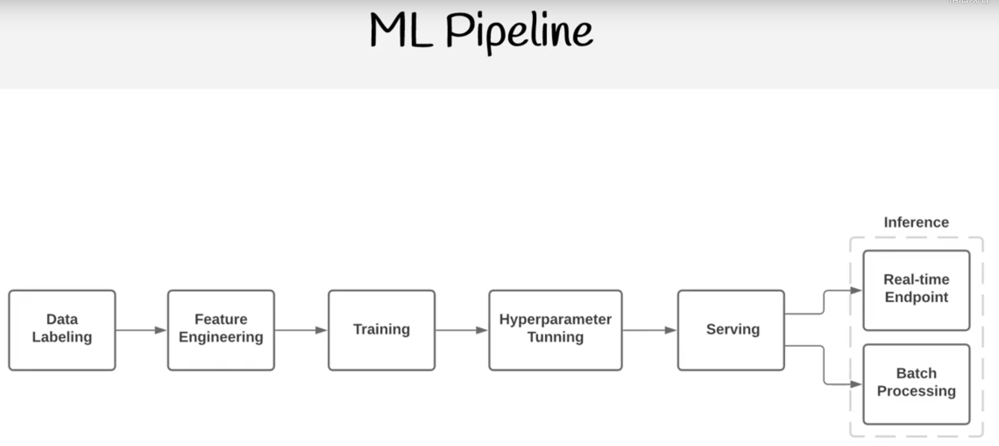

# Azure AI Fundamentals Certification 2024 (AI-900) - Full Course to PASS the Exam
### Level: Beginner
### Link: [YouTube](https://youtu.be/hHjmr_YOqnU?si=mWBipfvpflzMuoT4)
### Link: [Website: Exampro](https://app.exampro.co/student/journey/AI-900)
### Duration: 15 Hours
---

# Course Note
## Introduction

## ML and AI Concepts
### Layer of ML
- What is Artificial Intelligence (AI)?
  - Machines that perform jobs that mimic(模仿) human behavior.
- What is Machine Learning (ML)?
  - Machines that get better at a task without explicit programming(显式编程).
- What is Deep Leaning (DL)?
  - Machines that have an artificial neural network inspired by the human brain to solve complex problems.
- What is Data Scientist?
  - A person with multi-disciplinary(多学科) skills in math, statistics, predictive modeling and machine learning to make future predictions.

- AI>ML>DL

### Key Elements of AI
- AI is the software that imitates human behaviors and capabilities
- Key Elements (According to Microsoft/Azure)
  - Machine Learning - the foundation of an AI system, learn and predict like a human.
  - Anomaly detection(异常检测) - detect outliers or things out of place like a human. 像人类一样检测异常值或不合适的事物。
  - Computer Vision - be able to see like a human
  - Natural Language Processing - be able to process human languages and infer content(推断内容).
  - Conversational AI - be able to hold a conversation with a human.

### DataSets
- What is a dataset?
  - A data set is a logical grouping of units of data that are closely related and/or share the same data structure.
- There are publicly available data sets that used in the learning of statistics, data analytics, machine learning.
  - MNIST database
    - Image of handwritten digits used to test classification, clustering, and image processing algorithm.
    - Commonly used when learning how to build computer vision ML models to translate handwriting into digital text.
  - Common Objects In Context(COCO) dataset
    - A dataset which contains many common images using a JSON file (coco format) that identify objects or segments within an image.
    - features:
      - Object segmentation.(对象分割)
      - Recognition in context
      - Superpixel stuff segmentation
      - 329K images (>200K labeled)
      - 0.5 million object instance
      - 79 object categories
      - 90 stuff categories
      - 4 captions per image
      - 249000 people with keypoints

### Labeling
- What is Data Labeling?
  - the process of identifying raw data(原始数据) (images, text file, videos, etc.) and adding one or more meaningful and informative labels to provide context so that a machine leaning model can learn.
  - With supervised machine learning, labeling is a prerequisite(前提条件) to produce training data and each pieces of data will generally be labeled by a human.
  - With unsupervised machine learning, labels will be produced by machine, and may not be human readable.
- What is ground truth(基本事实)?
  - A properly labeled dataset that you use as the objectives standard to train and access a given model is often called "ground truth". The accuracy of your trained model will depend on the accuracy of your ground truth.

### Supervised Learning & Unsupervised Learning & Reinforcement Learning
- Supervised Learning (SL)
  - Data that has been labeled for training
  - Task-driven - make a prediction
  - When the labels are known and you want a precise(准确的) outcome.
  - When you need a specific value return.
  - eg. Classification, Regression
- Unsupervised Learning (SL)
  - Data has not been labeled, the ML model needs to do its own labeling.
  - Data-driven - recognize a structure or pattern
  - When the labels are not known and the outcome does not need to be precise.
  - When you are trying to make sense of data.
  - eg. Clustering, Dimensionality Reduction(降维), Association(关联)
-  Reinforcement Learning (RI)
   -  There is no data, there is an environment and an ML model generates data any many attempt(尝试) to reach a goal.
   -  Decisions-driven - Game AI, Learning Tasks, Robot Navigation.

### Neural Networks & Deep Learning
- What are Neural Networks? (NN)
  - Often described as mimicking(模仿) the brain, a neuron/node represents an algorithm.
  - Data is inputted into a neuron and based on the output the data will be passed to one of many other connected neural.
  - The connection between neurons is weighted(权重).
  - The network is organized in layers.
  - There will be a input layer, 1 to many hidden layers and an output layer.
- What is Deep Learning?
  - A neural network that has 3 or more hidden layers is considered deep learning.
- What is Feed Forward? (FNN)
  - Neural Networks where connections between nodes do not form a cycle. (always move forward)
- What is Backpropagation? (BP)
  - Moves backwards through the neural network adjusting weights to improve outcome on next iteration. This is how a neural net learns.
- What is Loss Function
  - A function that compares the ground truth to the prediction to determine the error rate (how bad the network performed)
- What is Activation Functions(激活函数)
  - An algorithm applied to a hidden layer node that affects connected output.
  - eg. ReLu
- What is Dense(稠密)
  - When the next layer increases the amount of nodes.
- What is Sparse(稀疏)
  - When the next layer decreases the amount of nodes.

### GPU
- What is a GPU
  - A General Processing Unit(GPU) that is specially designed to quickly render(渲染) high-resolution images and video concurrently.
- GPUs can perform parallel operations(并行操作) on multiple set of data, and so they are commonly used for non-graphical tasks such as machine learning and scientific computation(科学计算).
  - CPU can have average 4 to 16 processor cores
  - GPU can thousands of processor cores
  - 4 to 8 GPUs can provide as many as 40,000 cores.
- GPUs are best suited for repetitive(重复) and highly-parallel(高并发) computing tasks
  - Rendering graphics
  - Cryptocurrency(加密货币) mining
  - Deep Learning and Machine Learning

### CUDA (不考)
- What is NVIDIA
  - NVIDIA is a company that manufactures graphical processing units (GPUs) for gaming and professional markets.
- What is CUDA
  - Compute Unified Device Architecture(CUDA) is a parallel computing platform and API by NVIDIA that allows developers to use CUDA-enable GPUs for general-purpose computing on GPUs(GPGPU)
    - All major deep learning frameworks are integrated with NVIDIA Deep Learning SDK.
  - The NVIDIA Deep Learning SDK is a collection of NVIDIA libraries for deep learning.
  - One of those libraries is the CUDA Deep Neural Network library(cuDNN)
  - cuDNN provides highly tuned implementations for standard routines such as:
    - Forward and backward convolution(向前及向后卷积)
    - Pooling(池)
    - Normalization(标准化)
    - Activation layers(激活层)

### Machine Learning Pipeline

- Data Labeling
  - For supervised learning you need to label your data so the ML model can learn by example during training
- Feature Engineering
  - ML models only work with numerical data. 
  - So you need to translate it into a format that it can understand, extract out the important data that the ML needs to focus on.
- Training
  - Your model needs to learn how to become smarter. 
  - It will perform multiple iterations getting smarter with each iteration.
- Hyperparameter Tunning (超参数调优)
  - An ML model can have different parameters, we can use ML to try out many different parameters to optimize the outcome.
  - When you touch the deep learning, it is impossible to track the parameters by hand, you have to use hyperparameter tunning.
- Serving(deploy as a service)
  - We need to make our ML model accessible, so we serve by hosting in a virtual machine or container.
- Inference(推理)
  - Inference is the act of requesting to make a prediction.
  - Including:
    - Real-time Endpoint
    - Batch Processing

### Forecasting & Prediction
- What is a Forecasting? (预报)
  - Make a future prediction with relevant data
    - Analysis of trends
    - It's not "guessing"
- What is a Prediction? (预测)
  - Make a future prediction without relevant data
    - Use statistics to predict future outcomes
    - It's more of "guessing"
    - Uses decision theory(决策理论).

### Metrics
- What is Metrics
  - Performance/Evaluation Metrics are used to evaluate different Machine Learning Algorithms.
  - For different types of problems different metrics matter,(this is not an exhaustive list)
    - Classification Metrics
      - accuracy
      - precision
      - recall
      - F1-score
      - ROC
      - AUC
    - Regression Metrics
      - MSE
      - RMSE MAE
    - Ranking Metrics
      - MRR
      - DCG
      - NDCG
    - Statistical Metrics
      - Correlation
    - Computer Vision Metrics
      - PSNR
      - SSIM
      - IoU
    - NLP Metrics
      - Perplexity
      - BLEU
      - METEOR
      - ROUGE
    - Deep Learning Related Metrics
      - Inception score
      - Frechet Inception distance
  - There are two categories of evaluation metrics
    - Internal Evaluation - metrics used to evaluate the internals of the ML model
      - The famous four used in all kinds of models
        - Accuracy
        - F1 score
        - Precision
        - Recall
    - External Evaluation - metrics used to evaluate the final prediction of the ML model.

### Jupyter Notebook & JupyterLab
- What is Jupyter Notebook
  - A Web-based application for authoring(创作) documents that combine:
    - Live-code
    - Narrative text(叙述文字)
    - Equations(方程式)
    - Visualizations
  - iPython's notebook feature became Jupyter Notebook
  - Jupyter Notebooks were overhauled(大修，重构) and better integrated into an IDE called JupyterLab
    - You generally want to open Notebooks in Labs
    - The legacy(遗留的) web-based interface is known as Jupyter classic notebook

- What is JupyterLab
  - JupyterLab is a next-generation web-based user interface
  - All the familiar features of the classic Jupyter Notebook in a flexible and powerful user interface:
    - Notebook
    - Terminal
    - Text editor
    - File browser
    - Rich outputs
  - JupyterLab will eventually replace the classic Jupyter Notebook.

### Regression
- What is Regression
  - Regression is a process of finding a function to correlate(关联) a label dataset into continuous variable/number(连续变量/连续数字).
- Outcome: Predict this variable in the future.
- Theory:
  - Vectors(dots) are plotted on a graph in multiple dimensions, eg (X,Y)
  - A regression line is drawn though the dataset.
- Algorithm:
  - The distance of the vector from the regression line called an Error.
  - Different Regression Algorithms use the error to predict future variables:
    - Mean squared error (MSE)
    - Root mean squared error (RMSE)
    - Mean absolute error (MAE)
  
### Classification
- What is Classification
  - Classification is a process of finding a function to divide a labeled dataset into class/categories
- Outcome: Predict category to apply to the input data.
- Theory:
  - Vectors(dots) are plotted on a graph in multiple dimensions, eg (X,Y)
  - A classification line divides the dataset
- Algorithm:
  - Logistic Regression
  - Decision Tree/Random Forest
  - Neural Networks
  - Naive Bayes
  - K-Nearest Neighbors(KNN)
  - Support Vector Machines

### Clustering
- What is Clustering
  - Clustering is a process grouping unlabeled data base on similarities and differences.
- Outcome: Group data based on their similarities or differences.
- Theory:
  - Vectors(dots) are plotted on a graph in multiple dimensions, eg (X,Y)
  - Group the dataset based on their similarities or differences.
- Algorithm:
  - K-means
  - K-medoids
  - Density Based
  - Hierarchical
  
  ### Confusion Matrix
  - What is Confusion Matrix
    - A confusion matrix is table to visualize the model predictions(predicted) vs ground truth labels(actual).
    - Also known as an error matrix. They are useful in classification problems.
  - The size of matrix is dependent on the labels: 
    - Labels * 2 (Yes/No)
  - Indicator:
    - Actual No: false
    - Actual Yes: true
    - Predict No: negative
    - Predict Yes: positive
    - Actual No + Predict No = False Negative(FN)
    - Actual No + Predict Yes = False Positive(FP)
    - Actual Yes + Predict No = True Negative(TN)
    - Actual Yes + Predict Yes = True Positive(TP)
    - FN + FP = Total False (tF) 实际为No的总数
    - TN + TP = Total True (tT) 实际为Yes的总数
    - FN + TN = Total Negative (tN) 预测为No的总数
    - FP + TP = Total Positive (tP) 预测为Yes的总数
    - tF + tT = tN + tP = Total 总数

### Anomaly Detection AI
- What is an anomaly?
  - An abnormal thing.
  - A marked deviation(明显偏差) from the norm(规范) or a standard(标准).
- What is anomaly detection?
  - Anomaly Detection is the process of finding outliers(异常值) within a dataset called an anomaly. 异常检测是在称为异常的数据集中查找异常值的过程。
  - Detecting when a piece of(一段) data or access patterns(访问模式) appear suspicious(可疑) or malicious(恶意). 检测一段数据或访问模式何时出现可疑或者恶意。
- Use cases for anomaly detection
  - Data cleaning
  - Intrusion detection (入侵检测)
  - Fraud detection (欺诈检测)
  - Systems health monitoring (系统健康监控)
  - Event detection in sensor networks (传感器网络中的事件检测)
  - Ecosystem disturbances (生态系统干扰)
  - Detection of critical and cascading flaws (检测关键缺陷和级联缺陷)
- Why do we need anomaly detection
  - Anomaly detection by hand is a very tedious process.
  - Using machine learning for anomaly detection is more efficient and accurate.
- Anomaly detector: Detect anomalies in data to quickly identify and troubleshoot issues.

### Computer Vision
- What is computer vision?
  - Computer Vision is when we use Machine Learning Neural Networks to gain high-level understanding from digital images or video.
- Computer Vision Deep Learning Algorithms:
  - Convolutional neural network (CNN)(卷积神经网络) - Image and Video recognition. 
    - Inspired after how human eyes actually process information and send it back to brain to be processed.
  - Recurrent neural network (RNN)(循环神经网络) - Handwriting recognition or speech recognition.
- Types of Computer Vision
  - Image Classification - look at an image or video and classify (place it in a category)
  - Object Detection - identify objects within an image or video and apply labels and location boundaries.
  - Semantic Segmentation(语义分割) - identify segments or objects by drawing pixel mask (great for objects in movement) 通过绘制像素蒙版来识别片段或对象(非常适合运动中的对象)
  - Image Analysis -  analyze an image or video to apply descriptive and context labels.
    - eg. An employee sitting at a desk in Tokyo
  - Optical Character Recognition (OCR) - find text in images or videos and extract them into digital text for editing.
  - Facial Detection - detect faces in a photo or video, draw a location boundary, label their expression(表情).
- Computer Vision by Microsoft for iOS
  - Seeing AI is an AI app developed by Microsoft for iOS
    - Seeing AI uses the device camera to identify people and objects, and then the app audibly(有声地) describes those objects for people with visual impairment(视力障碍).
- Azure's Computer Vision Service Offering
  - Computer Vision - analyze images and video, and extract descriptions, tags, objects, and text.
  - Custom Vision - custom image classification and object detection models using your own images
  - Face - detect and identify people and emotions in images.
  - Form Recognizer - translate scanned documents into key/value or tabular(表格的) editable data.
  
### Natural Language Processing (NLP)
- What is NLP?
  - Natural Language Processing is Machine Learning that can understand the context of a corpus(语料库) (a body of related text).
- NLP enables you to:
  - Analyze and interpret(解释) text within documents, email messages
  - Interpret or contextualize(情景化) spoken token.
    - eg. sentiment analysis
  - Synthesize(合成) speech.
    - eg. a voice assistance talking to you.
  - Automatically translate spoken or written phrases and sentences between language.
  - Interpret spoken or written commands and determine appropriate(适当的) actions.
- What is Cortana?
  - Cortana is a virtual assistant developed by Microsoft which uses the Bing search engine to perform tasks such as setting reminders and answering questions for the user.
- Azure's NLP Service offering:
  - Text Analytics
    - Sentiment analysis to find out what customers think.
    - Find topic-relevant phrases using key phrase extraction. (使用关键短语提取查找主题相关的短语)
    - Identify the language of the text with language detection.
    - Detect and categorize entities in your text with named entity recognition.
  - Translator
    - Real-time text translation.
    - multi-language support.
  - Speech
    - Transcribe(转录) audible(可听的) speech into readable, searchable text.
  - Language Understanding (LUIS)
    - Natural language processing service that enables you to understand human language in your own application, website, chatbot, IoT device, and more.
  
### Conversational AI
- What is Conversational AI
  - Conversational AI is technology that can participate in conversations with humans.
    - Chatbots
    - Voice Assistants
    - Interactive(交互的) Voice Recognition Systems (IVRS 交互式语音识别系统)
- Use Cases
  - Online Customer Support
    - Replaces human agents for replying about customer FAQs, shipping
  - Accessibility
    - Voice operated UI for those who are visually impaired. 为视力障碍人士提供语音操作的用户界面。
  - HR processes
    - Employee training, onboarding, updating employee information.
  - Health Care
    - Accessible and affordable health care. 可获得且负担得起的医疗保健。
    - eg. claim processes
  - Internet of Things(IoT)
    - Amazon Alexa, Apple Siri, Google Home.
  - Computer Software
    - Autocomplete search on phone or desktop
- Azure's Conversational AI service offering:
  - QnA Maker
    - Create a conversational question-and-answer bot from your existing content(Knowledge base).
  - Azure Bot Service
    - Intelligent, serverless bot service that scales(扩展) on demand.
    - Used for creating, publishing, and managing bots.

### Responsible AI
- What is Responsible AI
  - Responsible AI focuses on ethical(道德的), transparent(透明的) and accountable(负责的) use of AI technologies.
- Microsoft puts into practice Responsible AI via its six Microsoft AI principles
  - Fairness - AI systems should treat all people fairly.
  - Reliability and Safety - AI systems should perform reliably and safely.
  - Privacy and Security - AI systems should be secure and respect privacy.
  - Inclusiveness(包容性) - AI systems should empower everyone and engage(吸引) people.
  - Transparency - AI systems should be understandable.
  - Accountability - People should be accountable for AI systems.

### Fairness
- What is Fairness?
  - AI systems should treat all people fairly.
  - AI systems can reinforce(加强) existing societal(社会的) stereotypical(刻板印象).
  - Bias can be introduced(引入) during the development of a pipeline.
- AI systems that are used to allocate(分配) or withhold(扣留):
  - Opportunities
  - Resources
  - Information
- In domains:
  - Criminal Justice
  - Employment and Hiring
  - Finance and Credit
- eg. A machine learning model is designed to select final applicants(申请人) for a hiring pipeline without incorporating(加入) any bias based on gender, ethnicity(种族) or may result in an unfair advantage(优势).
- Azure ML can tell you how each feature can influence(影响) a model's prediction for bias.
- Fairlearn is an open-source python project to help data scientist to improve fairness in their AI systems.

### Reliability and Safety
- What is reliability and safety
  - AI systems should perform reliably and safely.
  - AI software must be rigorous(严格的) tested to ensure they work as expected before release to the end user.
  - If there are scenarios where AI is making mistakes its important to release a report quantified(量化的) risks and harms to end-users so they are informed of the short-comings(缺点) of an AI solution.
- AI where concern for reliability and safety for humans is critically important:
  - Autonomous Vehicle
  - AI health diagnosis, AI suggesting prescriptions.
  - Autonomous Weapon Systems.

### Privacy and Security
- What is privacy and security
  - AI systems should be secure and respect privacy.
  - AI can require vasts amounts of data to train deep learning models.
  - The nature of the ML model(机器学习的性质) may require Personally Identifiable Information (PII)
  - It is important that we ensure protection of user data that it is not leaked(泄露) or disclosed(披露).
- In some cases ML models can be run locally on a user's device so their PII remains on their device avoiding that vulnerability(漏洞).
- AI Security Principles to detect malicious(恶意的) actors:
  - Data Origin and Lineage 数据起源与延续
  - Data Use Internal vs External 内部数据使用与外部数据使用
  - Data Corruption Considerations 数据损坏注意事项
  - Anomaly detection 异常检测

### Inclusiveness
- What is Inclusiveness
  - AI systems should empower everyone and engage people.
  - If we can design AI solutions for the minority(少数) of users. Then we can design AI solutions for the majority（广大） of users.
    - Minority:
      - Physical ability
      - Gender
      - Sexual orientation
      - Ethnicity
      - Other factors

### Transparency
- What is Transparency
  - AI systems should be understandable.
  - Interpretability(可解释性) / Intelligibility(可理解性) is when end-users can understand the behavior of the AI. 可解释性/可理解性是指最终用户可以理解AI的行为。
- Transparency of AI systems can result in:
  - Mitigating(缓解) unfairness
  - Help developers debug their AI systems
  - Gaining(取得) more trust from our users
- Those build AI systems should be:
  - Open about the why they are using AI.
  - Open about the limitations of their AI systems.
- Adopting(采用) an open-source AI framework can provide transparency (at least from a technical perceptive(技术角度)) on the internal workings of an AI system. 采用开源人工智能框架可以提供人工智能系统内部运作的透明度。
  
### Accountability
- What is accountability
  - People should be accountable for AI systems.
  - The structure put in place to consistently(始终如一地) enacting(制定) AI principles and taking them into account.
- AI systems should work within:
  - Framework of governance
  - Organization principles
- Ethical and legal standards that are clearly defined.
- Principles guide Microsoft on how they Develop, Sell and Advocate(提倡) when working with third-parties and this can push towards regulations towards AI Principles.

### AI Interaction (互动)
- Microsoft has a free web-app that goes through practical scenarios to teach Microsoft AI Principles: [Link](https://www.microsoft.com/en-us/haxtoolkit/ai-guidelines/)

### Azure Cognitive Services
- What is Azure Cognitive Services?
  - Azure Cognitive Services is a comprehensive(综合) family of AI services and cognitive APIs to help you build intelligent apps.
    - Create customizable, pre-trained models built with "breakthrough" AI Search.
    - Deploy Cognitive Services anywhere from the cloud to the edge with containers.
    - Get started quickly - no machine-learning expertise required.
    - Developed with strict ethical standards, empowering responsible use with industry-leading tools and guidelines.
- Types of services:
  - Decision(决策):
    - Anomaly Detector(异常检测器) - Identify potential problems early on.
    - Content Moderator(内容审核) - Detect potentially offensive(攻击性) or unwanted content.
    - Personaliser(个性化定制) - Create rich, personalized experiences for every user.
  - Language:
    - Language Understanding - Build natural language understanding into apps, bots and IoT devices.
    - QnA Maker - Create a conversational question and answer layer over your data.
    - Text Analytics - Detect sentiment, key phrases and named entities.
    - Translator - Detect and translate more than 90 supported languages.
  - Speech:
    - Speech to Text - Transcribe audible speech into readable, searchable text.
    - Text to Speech - Convert text to lifelike speech translation into your apps.
    - Speech Translation - Integrate real-time speech translation into your apps.
    - Speaker Recognition - Identify and verity the people speaking based on audio.
  - Vision:
    - Computer Vision - Analyze content in images and video.
    - Custom Vision - Customize image recognition to fit your business needs.
    - Face - Detect identify people and emotions in images.
  
- What is API Key and API Endpoint
  - Cognitive Services is an umbrella AI service that enables customers to access multiple AI services with an API key and an API Endpoint.

### Knowledge Mining:
- What is Knowledge Mining:
  - Knowledge Mining is a discipline(学科) in AI that uses a combination of intelligent services to quickly learn from vast(大量的) amounts of information.
  - It allows organizations to deeply understand and easily explore information, uncover(发现) hidden insights(见解), and find relationships and patterns at scale.
  - 3 Steps:
    - Ingest(提取): content from a range of sources, using connectors to first and third-party data stores.
      - Structured Data:
        - Database
        - CSV
      - Unstructured Data:
        - PDF
        - Video
        - Image
        - Audio
    - Enrich(浓缩): the content with AI capabilities that let you extract information, find patterns, and deepen understanding.
      - Cognitive Services
        - Vision
        - Language
        - Speech
        - Decision
        - Search
    - Explore: The newly indexed data via search, bots, existing business applications, and data visualization.
      - Enrich, Structured Data
        - Customer relationship management (CRM)
        - RAP System
        - Power BI
  
  

- Content Research
  

- Auditing, risk, compliance management
  

- Business process management
   

- Customer support and feedback analysis
  

- Digital asset management
  

- Contract management
  

### Face Service
- What is Face Service in Azure AI
  - Azure Face Service provides AI algorithms that detect, recognize, and analyze human faces in images.
  - Azure Face can detect:
    - face in an image. 
      - Face ID: unique identifier string for each detected face in an image.
    - face with specific attributes(属性).
      - Accessories. (Wearing accessories)
      - Age
      - Blur(模糊)(Blurriness of the face in the image)
      - Emotion
      - Exposure(接触)
      - Facial hair(胡子)
      - Gender(性别)
      - Glasses(眼镜)
      - Hair (头发)
      - Head pose (头部姿势)
      - Makeup (妆容)
      - Mask.(are they wearing a mask?)
      - Noise. The visual noise detected in the face image.
      - Occlusion(遮挡).(objects blocking parts of the face)
      - smile (笑容)
    - face landmarks(地标): 
      - easy-to-find points on a face 27 predefined landmark points.
    - similar face.
    - the same face as a specific identity across a gallery of images.

### Speech and Translate Service
- Azure's Translate service is a translation service.
  - It can translate 90 languages and dialects. Including Klingon
  - It uses Neural Machine Translation(NMT) replacing its legacy Statistical Machine Translation(SMT)
  - Custom Translator allows you to extend the service for translation based on your business and domain use case.
- Azure Speech service can speech synthesis(合成) service speech-to-text, text-to-speech, and speech-translation
  - Speech-to-Text
    - Real-time Speech-to-Text
    - Batch Speech-to-Text
    - Multi-device Conversation
    - Conversation Transcription
    - Create Custom Speech Models
  - Text-to-Speech
    - using Speech Synthesis Markup Language(SSML)
    - Create Custom Voices
  - Voice Assistance
    - Integrates with Bot Framework SDK
  - Speech Recognition
    - Speaker verification and identification.

### Text Analytics
- Text Analytics API is a Natural Language Processing (NLP) service for text mining and text analysis.
  - Text analytics can perform:
    - Sentiment analysis
      - find out what people think of your brand or topic
        - feature provides sentiment labels(such as "negative", "neutral", and "positive")
    - Opinion mining
      - aspect-based sentiment analysis
      - granular information about the opinions related to aspects
    - Key phrase extraction
      - quickly identify the main concepts in text.
    - Language detection
      - detect the language an input text is written in.
    - Named entity recognition(NER)
      - Identify and Categorize entities in your text as people, places, organizations, quantities,
      - Subset of NER is Personally Identifiable Information(PII)
- Key Phrase Extraction quickly identify the main concepts in text
  - Key phrase extraction works best when you give it bigger amounts of text to work on
  - This is opposite from sentiment analysis, which performs better on smaller amounts of text.
  - Document size must be 5120 or fewer characters per document, and you can have up to 1000 items(IDs) per collection.
- Named Entity Recognition detects words and phrases mentioned in unstructured text that can be associated with one or more semantic types.
  - Semantic types could be: Location, Event, Person, Diagnosis, Age.
- Sentiment analysis will apply labels and confidence score to text at the sentence and document level.
  - Labels include negative, positive, mixed or neutral.
  - Confidence scores ranging from 0 to 1.
- Opinion mining with provide more granular data with a Subject and Opinion tied to a Sentient.

### OCR Optical Character Recognition
- Optical Character Recognition(OCR) is the process of extracting printed or handwritten text into a digital and editable format.
  - photos of street signs
  - products
  - documents
  - invoices
  - bills
  - Financial reports
  - Articles
- OCR API
  - older recognition model
  - supports only images
  - executes synchronously(同步的)
    - returning immediately with the detected text
    - suited for less text
  - support more languages
  - easier to implement
- Read API
  - updated recognition model
  - supports images and PDFs
  - Executes asynchronously
    - parallelizes tasks per line for faster results
    - suited for lost of text
  - Supports fewer languages
  - A bit more difficult to implement
- OCR is performed via the Computer Vision SDK

### Form Recognizer
- Azure Form Recognizer is a specialized OCR service (translates printed text into digital and editable content) and preserves that structure and relationship of form-like data.
- Form Recognizer to automate data entry in your applications and enrich your documents search capabilities
- Form Recognizer can identify:
  - Key-value Pairs
  - Selection Marks
  - Table Structures

- Form Recognizer outputs structures such as:
  - Original file relationships
  - Bounding boxes
  - Confidence scores

- Form Recognizer is composed(组成) of 
  - Custom document processing models
  - Prebuilt models for invoices, receipts, IDs, business cards
  - The layout model

#### Form recognizer service - custom models
- Custom models allows you to extract text, key/value pairs, selection marks, and table data from forms
  - These models are trained with your own data, so they're tailored(量身定制) to your forms.
  - you only need five sample input forms to start.
  - A trained document processing model can output structured data that includes the relationships in the original form document.
  - After you train the model, you can test and retrain it and eventually use it to reliably extract data from more forms according to your needs.
- 2 Learning Options
  - Train without labels
    - use unsupervised learning to understand the layout and relationships between fields and entries in your forms.
  - Train with labels
    - used supervised learning to extract value of interest, using the labeled forms you provide(trained data)

#### Form recognizer service - Prebuilt Models
- Receipts
  - Sales receipts from Australia, Canada, Great Britain, India, and the United States
  - Fields Extracted
    - Receipt Type
    - Merchant Name
    - Merchant Phone Number
    - Merchant Address
    - Transaction Date
    - Transaction Time
    - Total
    - Subtotal
    - Tax
    - Tip
    - Items
    - Name
    - Quantity
    - Price
    - Total Price
- Business Card
  - English business card
  - Fields Extracted
    - Contact Names
    - First Name
    - Last Name
    - Company Names
    - Departments
    - Job Titles
    - Emails
    - Websites
    - Addresses
    - Mobile Phones
    - Faxes
    - Work Phones
    - Other Phones
- Invoices
  - Extracts data from invoices in various formats and returns structured data
  - Extracted Fields
    - Customer Name
    - Customer ID
    - Purchase Order
    - Invoice ID
    - Invoice Date
    - Due Date
    - Vendor Name
    - Vendor Address
    - Vendor Address Recipient
    - Customer Address
    - Customer Address Recipient
    - Billing Address
    - Billing Address Recipient
    - Shipping Address
    - Shipping Address Recipient
    - Sub Total
    - Total Tax
    - Invoice Total
    - Amount Due
    - Service Address
    - Service Address Recipient
    - Remittance Address
    - Remittance Address Recipient
    - Service Start Date
    - Service End Date
    - Previous Unpaid Balance
  - Extracted Line Item Data
    - Items
    - Amount
    - Description
    - Quantity
    - Unit Price
    - Product Code
    - Unit
    - Date
    - Tax
- Identity Documents (IDs)
  - World-wide passports and US driver licenses
  - Extracted Fields
    - Country Region
    - Date of Birth
    - Date of Expiration
    - Document Number
    - First Name
    - Last Name
    - Nationality
    - Sex
    - Machine Readable Zone
    - Document Type
    - Address
    - Region

### Language Understanding Service (LUIS)
- Language Understanding (LUIS) is a no-code ML service to build natural language into apps, bots and IoT devices.
- Quickly create enterprise-ready, custom models that continuously improve.
- LUIS is accessed via its own isolated domain at luis.ai
- LUIS utilizes Natural Language Processing(NLP) and Natural Language Understanding(NLU)
- NLU is the ability to transform a linguistic statement(语言陈诉) into a representation(表达) that enables you to understand your users naturally.
- LUIS is intended to focus on intention and extraction.
  - What the user wants
  - What they are talking about
- A LUIS application is composed of a schema
- This schema is autogenerated for you when you use the LUIS.ai web interface
- The schema defines:
  - Intentions - What the user is asking for.
    - a LUIS app always contains a None Intent.
  - Entities - What parts of the intent is used to determine the answer.
  - Utterance(言语) - Examples of user input that includes intent and entities to train the ML model to match predictions(预测) against real user input.
    - An intent requires one or more example utterance for training
      - It is recommended to have 15-30 example utterances
    - To explicitly train to ignore an utterance used the None Intent
  - Intents classify user utterances
  - Entities extract data from utterance

### Azure Machine Learning Service
- Azure Machine Learning Studio(classic)
  - An older service that manages AI/ML workloads. Does not have a pipeline and other limitations. Workloads are not easily transferable from classic to the new service.
- Azure Machine Learning Service
  - A service that simplifies running AI/ML related workloads allowing you to build flexible Automated ML Pipelines. Use Python or R, Run DL workloads such as Tensorflow.
  - Jupyter Notebooks
    - Build and document your machine learning models as you build them, share and collaborate.
  - Azure Machine Learning SDK for Python
    - An SDK designed specifically to interact with Azure Machine Learning Services
  - MLOps
    - end to end automation of ML model pipelines. eg. CI/CD, Training, inference.
  - Azure Machine Learning Designer
    - Drag and drop interface to visually build, test, and deploy machine learning models.
  - Data Labeling Service
    - ensemble(组件) a team of humans to label your training data.
  - Responsible Machine Learning
    - model fairness through disparity metrics and mitigate unfairness.(通过差异指标建立公平模型并减轻不公平现象)

### Azure Machine Learning Studio
- Author
  - Notebooks
    - Jupyter Notebooks, an IDE to write python code to build ML models
  - AutoML
    - Completely automated process to build and train a ML model.
  - Designer
    - Visual drag and drop designer to construct end to end ML pipelines
- Assets
  - Dataset
    - data that you upload which will be used for training
  - Experiments(实验)
    - When you run a training job they are detailed here
  - Pipeline
    - ML workflows you have built, or you have used in the Designer.
  - Models
    - a model registry(注册表) containing trained models that can be deployed
  - Endpoints
    - When you deploy a model its hosted on an accessible endpoint. eg. REST API.
- Manage
  - Compute
    - The underlying(底层的) computing instances used for notebooks, training, inference.
  - Environments
    - A reproducible(可重现的) Python environment for machine learning experiments.
  - Datastores
    - A data repository where your dataset resides
  - Data Labeling
    - Have humans with ML-assisted labeling label your data for supervised learning.
  - Linked Services
    - External services you can connect to the workspace. eg. Azure Synapse Analytics.

### Azure Machine Learning Studio - Compute
- Compute Instance
  - Development workstations that data scientists can use to work with data and models
- Compute Clusters
  - Scalable clusters of virtual machines for on-demand processing of experiment code
- Inference Clusters
  - Deployment targets for predictive services that use your trained models.
- Attached Compute
  - Links to existing Azure compute resources, such as Virtual Machines or Azure Databricks clusters.

### Azure Machine Learning Studio - Data Labeling
- Create Data labeling jobs to prepare your Ground Truth for supervised learning.
- Human-in-the-loop labeling
  - You have a team of humans that will apply labeling
  - These are humans you grant(授予) access to labeling
- Machine-learning-assisted data labeling
  - You will use ML to perform labeling
- You can export the label data for Machine Learning experimentation at any time.
- Users often export multiple times and train different models, rather than wait for all the images to be labeled.
- Image labels can be exported in:
  - COCO format
  - Azure Machine Learning dataset
    - dataset format makes it easy to user for training in Azure Machine Learning.

### Azure Machine Learning Studio - Data Stores
- Datastores securely connect to your storage service on Azure without putting your authentication credentials and the integrity(完整性) of your original data source at risk.
- Azure Blob Storage
  - data is stored as objects, distributed across many machines.
- Azure File Share
  - A mountable file share via SMB and NFS protocols.
- Azure Data Lake Storage(Gen 2)
  - Azure Blob storage designed for vasts amount of data for Big Data analytics.
- Azure SQL database
  - Full-managed MS SQL relational database
- Azure Postgres database
  - open-source relation database
- Azure MySQL database
  - Open-source relation database.

### Azure Machine Learning Studio - Datasets
- Azure ML Datasets makes it easy to register your datasets for use with your ML workloads.
  - There will be various metadata associated with your dataset
  - You can upload new datasets and they will be versioned(版本化)
  - Azure provides the same code snippet with the Azure Machine Learning SDK for Python to start programmatically using datasets in your Jupyter Notebooks.
- Generate Profile
  - You can create a data profile that has summary statistic, distribution of the data, and more. 
  - You will need to launch a compute instance to generate a profile.
- Open Datasets are publicly hosted datasets that are commonly used for learning how to build ML models
  - Azure has a curated list of open-datasets that you can quickly add your data store.
  - Great for learning how to use AutoML or Azure Machine Learning Designer.
  
### Azure Machine Learning Studio - Experiments
- Experiments is a logical grouping Azure Runs
- Runs are the act of running an ML task on a virtual machine or container.
- Experiments do not include Inference(推理).
- The contents of a run will vary based on its Run Type.

### Azure Machine Learning Studio - Piplines
- Azure ML Pipeline is an executable workflow of a complete machine learning risk
- Subtasks are encapsulated(封装的) as a series of steps within the pipeline.
- Independent steps allow multiple data scientists to work on the same pipeline at the same time without over-taxing(过度计费) compute resources.
- Separate steps also make it easy to use different compute types/sizes for each step.
- When you rerun a pipeline, the run jumps to the steps that need to be rerun, such as an updated training script.
- Steps that do not need to be rerun are skipped.
- After a pipeline has been published, you can configure a REST endpoint, which allows you to rerun the pipeline from any platform or stack.
- You can build pipelines two ways:
  - Using the Azure Machine Learning Designer
  - Programmatically using the Azure Machine Learning Python SDK.

### Azure Machine Learning Studio - ML Designer
- The Azure Machine Learning Designer lets you quickly build Azure ML Pipelines without having to write code.
- You can drag out various templated steps called assets to quickly prototype your pipeline.
- Once a pipeline is trained you can create an inference pipeline.
- You can toggle between your training in the inference pipeline

### Azure Machine Learning Studio - Models
- Model Registry allows you to create, manage and track your registered models as incremental(增加的) versions under the same name.
- Each time you register a model with the same name as an existing one, the registry assure that it's a new version.
- Additionally, you can provide metadata tags and use the tags when you search for models.

### Azure Machine Learning Studio - Endpoints
- Azure ML Endpoints allow you to deploy machine learning models as a web service.
- The workflow for deploying a model:
  - Register the model
  - Prepare an entry script
  - Prepare an inference configuration
  - Deploy the model locally to ensure everything works
  - Choose a compute target
  - Re-deploy the model to the cloud
  - Test the resulting web service
- Realtime endpoints
  - An endpoint that provides remote access to invoke the ML model service running on either:
    - Azure Kubernetes Service (AKS)
    - Azure Container Instance (ACI)
- Pipeline endpoints
  - An endpoint that provides remote access to invoke a ML pipeline.
  - You can parameterize the pipeline endpoint for managed repeatability in batch scoring and retraining scenarios.
  - When you deploy a model to an endpoint it will either be deployed to:
    - Azure Kubernetes Service (AKS)
    - Azure Container Instance (ACI)
- When you have deployed a real-time endpoint you can test the endpoint by sending a single request or a batch request.
- The computing resource will not show in Azure Machine Learning Studio, you need to check AKS or ACI

### Azure Machine Learning Studio - Notebooks
- Azure has a built-in Jupyter-like Notebook editor so you can build and train your ML models
- Choose Compute
  - You need to crate a compute instance to run your Notebook
- Choose Kernel
  - You need to choose a Kernel that preloads a programming language and programming libraries for different use cases
- You can open the Notebook in a more familiar IDE:
  - VSCode
  - Jupyter Notebook(classic)
  - Jupyter Lab

### AutoML
- Automated machine learning (AutoML) automates the process of creating an ML model.
- With Azure AutoML you 
  - supply a dataset
  - Choose a Task Type (Classification, Regression, or Time Series Forecasting)
  - Then AutoML will train and tune your model
- 3 Task Type
  - Classification
    - When you need to make a prediction based on several classes:
      - Binary classification: Yes or No.
      - Multi-class classification: Red, Green, Blue
    - Classification is a type of supervised learning in which models learn using training data, and apply those learning to new data.
    - The goal of classification models is to predict which categories new data will fall into based on learnings from its training data:
      - binary classification: a record is labeled out of two possible labels. E.g: true or false.
      - multiclass classification: a record is labeled out of a range of labels: happy, sad, mad, rad.
  - Regression
    - When you need to predict a continuous number value
    - Regression is a type of supervised learning in which models learn using training data, and apply those learnings to new data.
    - The goal of regression is to predict a variable in the future.
  - Time Series Forecasting
    - When you need to predict the value based on time
    - Forecast revenue, inventory, sales, or customer demand
    - An automated time-series experiment is treated as a multivariate(多变量) regression problem.
    - Past time-series values are "pivoted" to become additional dimensions for the regressor together with other predictors
    - Unlike classical time series methods, has an advantage of naturally incorporating multiple contextual variables and their relationship to one another during training(与经典时间序列方法不同，它的优点是在训练期间自然地合并多个上下文变量及其相互关系)
    - Advanced forecasting configuration includes:
      - holiday detection and featurization
      - time-series and DNN learners (Auto-ARIMA, Prophet, ForecastTCN)
      - many models support through grouping
      - rolling-origin cross validation
      - configurable lags
      - rolling window aggregate features

### AutoML - Data Guard Rails (数据护栏)
- Data guardrails are run by Azure AutoML when automatic featurization is enabled. 
- A sequence of checks to ensure high-quality input data is being used to train the model.

### AutoML - Automatic Featurization
- During model training with AutoML, one of the following scaling(缩放) or normalization techniques will be applied to each model.
  - StandardScaleWrapper - Standardize features by removing the mean(均值) and scaling to unit variance(单位方差).
  - MinMaxScalar - Transforms features by scaling each feature by that column's minimum and maximum.
  - MaxAbsScaler - Scale each feature by its maximum absolute value.
  - RobustScalar - Scales features by their quantile range.
  - Principal component analysis (PCA) - Linear dimensionality reduction using Singular Value Decomposition of the data to project it to a lower-dimensional space.
  - TruncatedSVDWrapper - This transformer performs linear dimensionality reduction by means of truncated singular value decomposition (SVD)
    - Contrary to PCA, this estimator does not center the data before computing the singular value decomposition, which means it can work with scipy.sparse matrices efficiently
  - SparseNormalizer - Each sample (that is, each row of the data matrix) with at least one non-zero component is rescaled independently of other samples so that its norm (l1 or l2) equals one.

### AutoML - Model Selection
- Model selection is the task of selecting a statistical model from a set of candidate models.
- Azure AutoML will use many different ML Algorithms and will recommend the best performing candidate.

### AutoML - Explanation
- ML Explainability (MLX) is the process of explaining and interpreting ML and deep learning models.
- MLX can help machine learning developers to better understand and interpret the model's behavior.
- After your top candidate model is selected by Azure AutoML you can get an explanation of the internals on various factors:
  - Model Performance
  - Dataset explorer
  - Aggerate feature importance
  - Individual feature importance

### AutoML - Primary Metrics
- The primary metric parameter determines the metric to be used during model training for optimization.
- Classification
  - Suited for large datasets that well-balanced
    - Accuracy - Image classification, Sentiment analysis, Churn prediction.
    - Average_precision_score_weighted - Sentiment analysis
    - Norm_macro_recall - Churn prediction
    - Precision_score_weighted
  - Suited for small dataset that are imbalanced
    - AUC_weighted  - Fraud detection, Image classification, Anomaly detection/spam detection
- Regression
  - Works well when the value to predict encompasses a large range eg. 10K to 200K
    - Spearman_correlation
    - r2_score - Airline delay, Salary estimation, Bug resolution time.
  - Works well when value to predict encompasses as smaller range eg. 10-20k
    - Normalized_root_mean_squared_error - Price prediction (house/product/tip), Review score prediction.
    - Normalized_mean_absolute_error
- Time Series
  - Works well when value to predict encompasses as large range eg. 10K to 200K 
    - Spearman_correlation
    - r2_score - Price prediction(forecasting), Inventory optimization, demand forecasting.
  - Works well when value to predict encompasses as smaller range eg. 10-20k
    - Normalized_root_mean_squared_error - Price prediction (forecasting), Inventory optimization, demand forecasting.
    - Normalized_mean_absolute_error

### AutoML - Validation Type
- Model Validation is when we compare the results of our training dataset to our test dataset.
- Model Validation occurs after we train the model
- With AutoML you can change the validation type.

