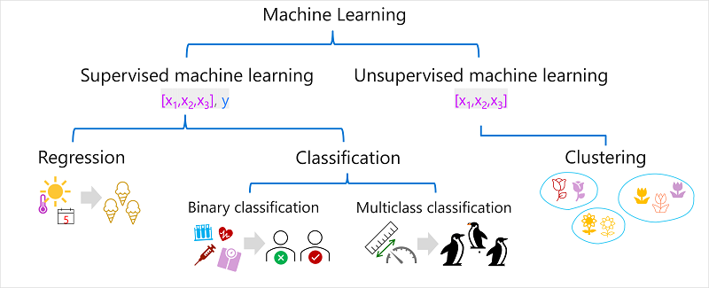
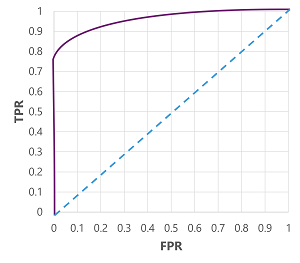

# Fundamentals of Machine Learning
### Level: Beginner
### Link: [Microsoft Learn](https://learn.microsoft.com/en-us/training/modules/fundamentals-machine-learning/)
### Duration: 5 Hours
---

## Course Note
### What is machine learning
- Machine learning has its origins in statistics and mathematical modeling of data. 机器学习起源于数据的统计和数学建模。
- The fundamental idea of machine learning is to use data from past observations to predict unknown outcomes or values. 机器学习的基本思想是使用过去观察的数据来预测位置的结果或值。
- A machine learning model is a software application that encapsulates a function to calculate an output value based on one or more input values. 机器学习是一种软件应用，它封装了根据一个或多个输入值计算出值的“函数”。
- The process of defining that function is known as training. 定义函数的过程就叫“训练”。
- After the function has been defined, you can use it to predict new values in a process called inferencing. 模型训练好后，使用模型预测新值的过程叫“推理”。
  
### Steps involved in training and inferencing
1. The training data consists of past observations. 将过去观察结果作为训练的数据
   - In most cases, the observations include the observed attributes or features of the thing being observed, and the known value of the thing you want to train a model to predict (known as the label) 多数情况下观察结果包括：被观察实物的属性或特征，想要模型预测的已知结果（就是“标签”）
2. An algorithm is applied to the data to try to determine a relationship between the features and the label, and generalize that relationship as a calculation that can be performed on x to calculate y. 算法使用数据来常识确定特征和标签之间的关系，并将该关系概括为对X进行计算，得到Y的计算。
   - the basic principle is to try to fit the data to a function in which the values of the features can be used to calculate the label. 基本原则是尝试“拟合”数据得到一个函数，这个函数可以用特征值来计算标签值。
3. The result of the algorithm is a model that encapsulates the calculation derived by the algorithm as a function f. 算法的结果是一个模型，即将算法导出的计算方法封装为“函数”。
4. The training phase is complete, the trained model can be used for inferencing. 训练阶段完成，训练后的模型就可以用于推理了。
   - The model is essentially a software program that encapsulates the function produced by the training process. 模型本质上是一个封装了训练过程产生的函数的软件程序。
   - You can input a set of feature values, and receive as an output a prediction of the corresponding label. 你可以输入一组特征值，并接受相应标签的预测作为输出。
   - Because the output from the model is a prediction that was calculated by the function, and not an observed value, you'll often see the output from the function shown as ŷ (which is rather delightfully verbalized as "y-hat").输出的是预测值，而不是观察值，所以不用y表示，用ŷ表示

### Types of machine learning

- Supervised machine learning 监督学习
  - A general term for machine leaning algorithms in which the training data include both feature values and known label values. 学习数据包括特征值和已知标签值的机器学习算法一类。
  - Training a supervised machine learning model involves multiple iterations in which you use an appropriate algorithm to train a model, evaluate the model's predictive performance, and refine the model by repeating the training process with different algorithms and parameters until you achieve an acceptable level of predictive accuracy. 监督学习训练模型涉及多次迭代，使用不用的算法来训练，然后评估预测效果，再重复训练直到模型的预测准确度达到预期。
  - Types of Supervised ML
    - Regression. 回归
      - A form of supervised ML in which the label predicted by the model is numeric value. 模型预测的标签是一个数值。
    - Classification. 分类
      - A form of supervised ML in which the label represents a categorization or class. 标签代表分类别或类
      - Types of Classification
        - Binary classification. 二元分类
          - The label determines whether the observed item is (or isn't) an instance of a specific class. 标签确定被观察项目是或不是一个特定类的实例。
          - Predict one of two mutually exclusive outcomes. 预测两个互斥的结果。
        - Multiclass classification 多元分类
          - Extends binary classification to predict a label that represents one of multiple possible classes. 扩展了二元分类以预测表示多个互斥可能类别的标签。
  - 4 Key Elements of the training process of supervised ML model:
    - Split the training data (randomly) to create a dataset with which to train the model while holding back a subset of the data that you'll use to validate the trained model. 把数据随机分为两部分。 一部分用于训练模型，一部分用于验证模型。
    - Use an algorithm to fit the training data to a model. 使用算法将训练数据拟合成模型。
    - Use the validation data you held back to test the model by predicting labels for the features. 使用验证数据来测试模型预测。
    - Compare the known actual labels in the validation dataset to the labels that the model predicted. Then aggregate the differences between the predicted and actual label values to calculate a metric that indicates how accurately the model predicted for the validation data. 比较验证数据集中的实际标签和预测结果。汇总差异，以得到验证预测准确性的指标值。
    - After each train, validate, and evaluate iteration, you can repeat the process with different algorithms and parameters until an acceptable evaluation metric is achieved. 不断重复，直到指标值达到预期。

- Unsupervised machine learning 无监督学习
  - Involves training models using data that consists only of feature values without any known labels. 训练数据仅包含特征值，不包含已知标签值。
  - Determine relationships between the features of the observations in the training data. 确定训练数据中被观察项目之间的关系。
  - Types of Unsupervised ML
    - Clustering 聚类
      - Identifies similarities between observations based on their features, and groups them into discrete clusters. 根据被观察项目的特征识别出观察值的关系，并将其放到离散的簇分组中。

---

### Regression 回归
- Regression models are trained to predict numeric label values based on training data that includes both features and known labels. 回归模型用于预测数字标签值， 其训练数据包括特征和已知结果标签。
- Step of Training
  - Training a regression model
    - Split the data and use a subset of it to train the model. 拆分数据集。
    - Plot data as coordinates along two axes to get an insight of how these x and y values might relate to one another. 将数据放到XY坐标轴中。
    - Apply an algorithm to the training data and fit it to a function that applies an operation to x to calculate y. 应用算法来拟合模型。
  - Evaluating a regression model
    - Use the model to predict the label for each of the observations in rest dataset based on the feature (x) value. 用剩余数据来生成结果。
    - Compare the predicted label (ŷ) to the known actual label value (y). 比较预期结果与生成结果。
  - Regression evaluation metrics 评估指标
    - Mean Absolute Error (MAE) 平均绝对误差
      - Calculate the absolute error for each prediction. 计算每个预测与实际值之间的绝对差值。
      - Summarized for the whole validation set as the mean absolute error (MAE). 将所有绝对差求平均值。
    - Mean Squared Error (MSE) 均方误差
      - Produce a metric that "amplifies" larger errors by squaring the individual errors and calculating the mean of the squared values. 将绝对值差求平方，再将平方值求平均，得到均方误差。放大差值，以求获得单个差值小的模型，而不是错误数量少的模型。
    - Root Mean Squared Error (RMSE) 均方根误差。
      - Calculate the square root of the MSE to measure the error in terms of the number. 对均方误差求根。回归到对错误数量的评估。
    - Coefficient of determination (R2)
      - The coefficient of determination (more commonly referred to as R2 or R-Squared) is a metric that measures the proportion of variance in the validation results that can be explained by the model, as opposed to some anomalous aspect of the validation data. 验证可以用模型解释的差异，而不是数据方面的差异。
      - Compares the sum of squared differences between predicted and actual labels with the sum of squared differences between the actual label values and the mean of actual label values, like this: R2 = 1- ∑(y-ŷ)^2 ÷ ∑(y-ȳ)^2 将训练后模型的预测与对应实际值的之间的平方差与优化后模型的预测值与对应实际值之间的额平方差进行比较
  - Iterative training 迭代训练
    - Adjust:
      - Feature selection and preparation (choosing which features to include in the model, and calculations applied to them to help ensure a better fit). 调整特征，改进拟合。
      - Algorithm selection. 调整算法。
      - Algorithm parameters (numeric settings to control algorithm behavior, more accurately called hyperparameters to differentiate them from the x and y parameters). 调整参数。

### Binary classification 二分分类
- A supervised machine learning technique
- Train classification models calculate probability values for class assignment and the evaluation metrics used to assess model performance compare the predicted classes to the actual classes. 计算类别的分配概率
- Binary classification algorithms are used to train a model that predicts one of two possible labels for a single class. Essentially, predicting true or false. 用于预测结果属于两个类型的哪一个，就是预测真/假
- Step of Training
  - Training a binary classification model
    - Use an algorithm to fit the training data to a function that calculates the probability of the class label being true. Probability is measured as a value between 0.0 and 1.0, such that the total probability for all possible classes is 1.0.  用算法拟合数据来计算分类标签位真的概率。值可能是0.0-1.0之间。那么总概率就是1
  - Evaluating a binary classification model
    - Use rest dataset to evaluating.
  - Binary classification evaluation metrics
    - Create a matrix of the number of correct and incorrect predictions for each possible class label. 创建正确和错误预测的数据矩阵。
      - confusion matrix, and it shows the prediction totals where:
        - ŷ=0 and y=0: True negatives (TN)
        - ŷ=1 and y=0: False positives (FP)
        - ŷ=0 and y=1: False negatives (FN)
        - ŷ=1 and y=1: True positives (TP)
      - The arrangement of the confusion matrix is such that correct (true) predictions are shown in a diagonal line from top-left to bottom-right. 左上角到右下角的对角线上放置正确预测的数量。
    - Metrics
      - Accuracy 准确性
        - the proportion of predictions that the model got right. 模型正确预测的比例。
        - (TN+TP) ÷ (TN+FN+FP+TP)
      - Recall 召回
        - the proportion of positive cases that the model identified correctly. 所有实际为真中，预测为真的比例。越高说明越少的正确答案被漏掉。
        - Another name for recall is the true positive rate (TPR), and there's an equivalent metric called the false positive rate (FPR).
        - TPR: TP ÷ (TP+FN)
        - FPR: FP ÷ (FP+TN)
      - Precision 精确性
        - the proportion of predicted positive cases where the true label is actually positive. 预测为真中，实际为真的比例。 越高说明越少的错误答案混入。
        - TP ÷ (TP+FP)
      - F1-score
        - An overall metric that combined recall and precision. 结合召回和精确的总体指标。
        - (2 x Precision x Recall) ÷ (Precision + Recall)
      - Area Under the Curve (AUC) 曲线下面积
        - If we were to change the threshold above which the model predicts true (1), it would affect the number of positive and negative predictions; and therefore change the TPR and FPR metrics. These metrics are often used to evaluate a model by plotting a received operator characteristic (ROC) curve that compares the TPR and FPR for every possible threshold value between 0.0 and 1.0. 如果调整判断为真的阈值，就会改变真/假预测结果的数量。从而影响到TPR和FPR指标。通常使用ROC来对比TPR和FPR。
        - The ROC curve for a perfect model would go straight up the TPR axis on the left and then across the FPR axis at the top. Since the plot area for the curve measures 1x1, the area under this perfect curve would be 1.0 (meaning that the model is correct 100% of the time). In contrast, a diagonal line from the bottom-left to the top-right represents the results that would be achieved by randomly guessing a binary label; producing an area under the curve of 0.5. In other words, given two possible class labels, you could reasonably expect to guess correctly 50% of the time. 比较好的ROC曲线将眼左侧TPR轴直线上升，穿过FPR顶部。曲线下的面积就是XY轴的面积。说明100%正确。如果是对角线，则曲线下面积为50%，即预测正确率是50%。
        - 

### Multiclass classification 多类型分类
- Predict to which of multiple possible classes an observation belongs. 预测结果可能属于多个结果中的哪一个。
- Multiclass classification algorithms are used to calculate probability values for multiple class labels, enabling a model to predict the most probable class for a given observation. 选择概率最高的那一个。
- Step of training
  - Training a multiclass classification model
    - One-vs-Rest (OvR) algorithms 1对1算法
      - One-vs-Rest algorithms train a binary classification function for each class, each calculating the probability that the observation is an example of the target class. 1对1算法为每个类别拟合二分分类，每一个计算的概率都是目标分类的示例。
      - Each algorithm produces a sigmoid function that calculates a probability value between 0.0 and 1.0. A model trained using this kind of algorithm predicts the class for the function that produces the highest probability output. 每个算法生成一个sigmoid函数，用于计算概率值。再取出预测中概率最高的作为输出。
    - Multinomial algorithms 多项式算法
      - A single function that returns a multi-valued output. The output is a vector (an array of values) that contains the probability distribution for all possible classes - with a probability score for each class which when totaled add up to 1.0. 一个函数生成多个输出值。输出值以向量的形式组织，包括了概率分布，但总概率为1.
  - Evaluating a multiclass classification model
    - evaluate a multiclass classifier by calculating binary classification metrics for each individual class. 对每个二元分类进行评估，再汇聚到一起，以得到多类型分类的评估。
    - The metrics is the same as binary classification. 评估指标与二元分类一致。

---

### Clustering 聚类
- Clustering is a form of unsupervised machine learning in which observations are grouped into clusters based on similarities in their data values, or features. 无监督学习，根据观察到的特征或值将观察结果分组聚类。
- Training a clustering model
  - K-Means Clustering
    - The feature (x) values are vectorized to define n-dimensional coordinates (where n is the number of features) 特征X值被向量化到n维坐标中。
    - You decide how many clusters you want to use to group the dataset - call this value k. Then k points are plotted at random coordinates. These points become the center points for each cluster, so they're called centroids. 确定要在这个向量空间中聚类的簇数k（就是分k个组），将每个簇随机放到向量空间中。簇的中心叫质心
    - Each data point is assigned to its nearest centroid. 每个数据点都被分配到最近的质心中。
    - Each centroid is moved to the center of the data points assigned to it based on the mean distance between the points.计算这个簇中所有的数据点距离，将质心移动到数据点群的中心位置。
    - After the centroid is moved, the data points may now be closer to a different centroid, so the data points are reassigned to clusters based on the new closest centroid.移动质心后，数据点对应的最近的质心可能会变化。那么就根据新的距离调整数据点和质心的关系。保持数据点对应其最近的质心。
    - The centroid movement and cluster reallocation steps are repeated until the clusters become stable or a predetermined maximum number of iterations is reached. 重复移动质心和数据点，直到相对稳定或达到最大的迭代次数。
    - 未来新的数据输入，就根据与质心的距离来判断其归类到哪一簇。
- Evaluating a clustering model
  - Average distance to cluster center: How close, on average, each point in the cluster is to the centroid of the cluster. 到聚类中心的平均距离，聚类中每个店到聚类质心的平均距离有多近。
  - Average distance to other center: How close, on average, each point in the cluster is to the centroid of all other clusters. 到其他中心的平均距离，簇中每个点到其他簇的质心的平均距离有多近。
  - Maximum distance to cluster center: The furthest distance between a point in the cluster and its centroid. 到簇中心的最大距离，簇中的点与质心之间的最远距离。
  - Silhouette: A value between -1 and 1 that summarizes the ratio of distance between points in the same cluster and points in different clusters (The closer to 1, the better the cluster separation). -1到1之间的值，总结了同一簇中的点与不同簇中的点之间的距离比例。越接近1越好。

---

### Deep Learning 深度学习
- Deep learning is an advanced form of machine learning that tries to emulate the way the human brain learns. 深度学习是机器学习的高级形态，模拟人脑的学习方式。
- The key to deep learning is the creation of an artificial neural network that simulates electrochemical activity in biological neurons by using mathematical functions. 深度学习的关键是使用数学方式建立生物神经的电信号活动类似的人工神经网络。
- Artificial neural networks are made up of multiple layers of neurons - essentially defining a deeply nested function. 人工神经网络由多层神经元组成，本质上是一个深度嵌套的函数。
- Deep learning involves fitting training data to a function that can predict a label (y) based on the value of one or more features (x). The function (f(x)) is the outer layer of a nested function in which each layer of the neural network encapsulates functions that operate on x and the weight (w) values associated with them. The algorithm used to train the model involves iteratively feeding the feature values (x) in the training data forward through the layers to calculate output values for ŷ, validating the model to evaluate how far off the calculated ŷ values are from the known y values (which quantifies the level of error, or loss, in the model), and then modifying the weights (w) to reduce the loss. The trained model includes the final weight values that result in the most accurate predictions. 深度学习使用训练数据拟合可以基于一个或多个特征预测结果标签的函数。这个函数是嵌套函数的外层，其中神经网络的每一层都封装了对特征x及其关联的权重值w进行计算操作的函数。用于训练模型的算法涉及通过各层，迭代地向前输送训练数据中的特征值x，以计算ŷ的输出值。验证模型以评估计算出的ŷ值与已知y值的偏差程度。（它量化模型中的错误或损失水平），然后修改权重w以减少损失。训练后的模型包括可以产生最准确预测的最终权重值。

- Using deep learning for classification
  - The feature vector for a observation is fed into the input layer of the neural network, which consists of a neuron for each x value. 观察对象的特征向量放入到神经网络输入层，该神经网络由每个x值的神经元组成。
  - The functions for the first layer of neurons each calculate a weighted sum by combining the x value and w weight, and pass it to an activation function that determines if it meets the threshold to be passed on to the next layer. 第一层神经元的函数各自通过组合x值和权重w来计算加权和，并将其传递给激活函数，该函数确定它是否满足传到下一层的阈值。
  - Each neuron in a layer is connected to all of the neurons in the next layer (an architecture sometimes called a fully connected network) so the results of each layer are fed forward through the network until they reach the output layer. 一层中的每个神经元都连接到下一层中的所有神经元，（全连接网络），每一层的结果都通过网络向前输送，直到到达输出层。
  - The output layer produces a vector of values. 输出层产生一个向量值。
  - The elements of the vector represent the probabilities for each class, and choose the highest one. 向量的元素代表各个类别的概率，选取概率最高的作为结果。

- How does a neural network learn
  - The weights in a neural network are central to how it calculates predicted values for labels. 权重是神经网络里面至关重要的参数。
  - The training and validation datasets are defined, and the training features are fed into the input layer. 定义训练和验证，并将训练特征值输送到输入层。
  - The neurons in each layer of the network apply their weights (which are initially assigned randomly) and feed the data through the network. 每一层中的神经元赋予自己的权重，并通过网络输送。初期权重一般是随机的。
  - The output layer produces a vector containing the calculated values for ŷ. 输出层输出包含计算结果值ŷ的向量。
  - A loss function is used to compare the predicted ŷ values to the known y values and aggregate the difference (which is known as the loss).In reality, the loss function calculates the aggregate variance for multiple cases and summarizes it as a single loss value. 损失函数用于将预测的ŷ与已知的y值进行比较并汇总差异（损失）。一般损失函数计算多种情况下的聚合方差，并将其汇总为单个损失值。
  - Since the entire network is essentially one large nested function, an optimization function can use differential calculus to evaluate the influence of each weight in the network on the loss, and determine how they could be adjusted (up or down) to reduce the amount of overall loss. The specific optimization technique can vary, but usually involves a gradient descent approach in which each weight is increased or decreased to minimize the loss. 由于整个网络本质上是一个大型的嵌套函数，因此优化函数可以使用微分计算来评估网络中每个权重对损失的影响，并确定如何调整他们，以减少总体矢量损失。具体优化技术可能有所不同，但通常涉及梯度下降方法，其中增加或减少每个权重以最小化损失。
  - The changes to the weights are backpropagated to the layers in the network, replacing the previously used values. 权重的变化被反向传播到网络中的各层，替换之前使用的值。
  - The process is repeated over multiple iterations (known as epochs) until the loss is minimized and the model predicts acceptably accurately. 这过程会重复多次迭代（称为 epochs），直到损失最小化并且模型的预测准确度可以接受。

---

### Azure Machine Learning
- Microsoft Azure Machine Learning is a cloud service for training, deploying, and managing machine learning models. Azure机器学习是一个用于训练、部署、管理模型的云服务。包括：
  - Exploring data and preparing it for modeling. 浏览数据或为模型准备数据。
  - Training and evaluating machine learning models. 训练和评估模型
  - Registering and managing trained models. 注册和管理已训练的模型
  - Deploying trained models for use by applications and services. 部署已训练的模型，用于应用和服务
  - Reviewing and applying responsible AI principles and practices. 审查人工智能原则和实践。

- Features and capabilities of Azure Machine Learning
  - Centralized storage and management of datasets for model training and evaluation. 为模型训练和评估的数据提供中心化存储和管理。
  - On-demand compute resources on which you can run machine learning jobs, such as training a model. 提供运行机器学习工作需要的计算资源。
  - Automated machine learning (AutoML), which makes it easy to run multiple training jobs with different algorithms and parameters to find the best model for your data. 自动化机器学习，可以使用不同的算法和参数进行多个训练工作，找到最适合的模型。
  - Visual tools to define orchestrated pipelines for processes such as model training or inferencing. 用于定义模型训练或推理等流程的编排管道可视化工具。
  - Integration with common machine learning frameworks such as MLflow, which make it easier to manage model training, evaluation, and deployment at scale. 集成通用机器学习框架，用于管理模型训练、评估和部署。
  - Built-in support for visualizing and evaluating metrics for responsible AI, including model explainability, fairness assessment, and others. 内置的对AI责任的可视化和评估指标的支持，包括模型的可解释性，公平性评估等。